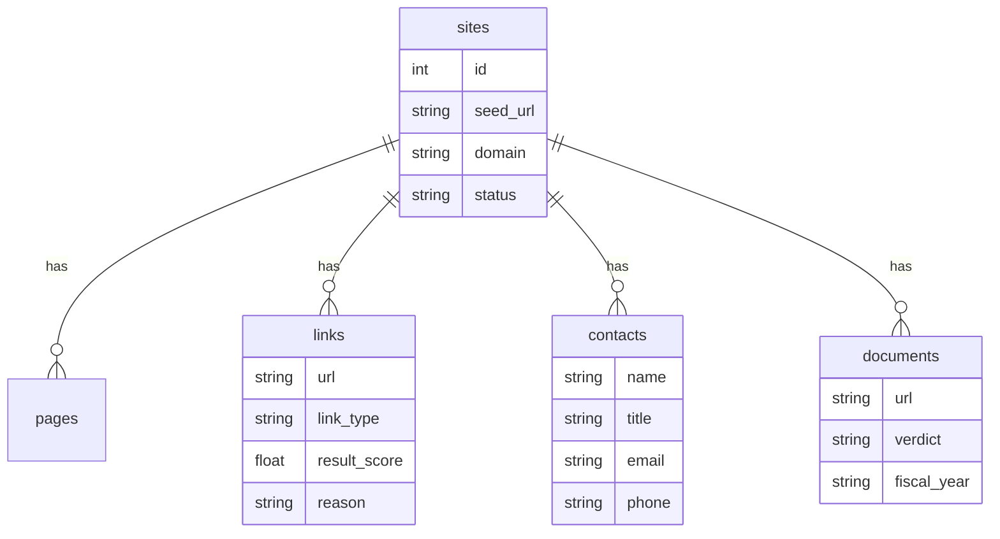
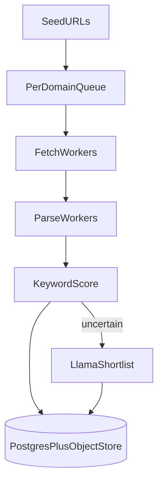

# High-Value Link Scraper

Crawl a public institution homepage, rank links that look like finance documents or finance contacts, store the results in SQLite, and serve them through a small FastAPI API.

Targets: ACFR/CAFR and budget documents, plus contacts such as a Finance Director. Keyword rules do the first pass. An optional Llama model (via Ollama) can re-rank uncertain links, help bind names to titles, and second-guess PDF confirmation.

## Setup

```bash
python3 -m venv .venv
source .venv/bin/activate
pip install -r requirements.txt
```

Or with `uv`:

```bash
uv venv .venv
uv pip install -r requirements.txt
```

Run the API:

```bash
source .venv/bin/activate
export PYTHONPATH=.
uvicorn app.main:app --reload --port 8000
```

Optional Llama (Ollama):

```bash
export OLLAMA_URL=http://127.0.0.1:11434
export OLLAMA_MODEL=llama3.1:8b
```

If `OLLAMA_URL` is unset, the scraper uses keyword rules only.

## How ranking works

Each link gets two scores from the URL, anchor text, and nearby heading/list text, using weights in [`app/keywords.yaml`](app/keywords.yaml):

- **Follow score** — should the crawler open this page next? Terms like `finance`, `budget`, and `government` help. Parking, trash, jobs, and social links are pushed down.
- **Result score** — is this worth storing as a document, contact, or high-value navigation page?

Document links (`.pdf`, `.xlsx`, …) with finance keywords are checked: the first three pages are read (50 MB cap) and labeled `confirmed`, `mismatch`, `unreadable`, or `skipped`.

Contacts are pulled from staff/contact pages when name, title, email, or phone is present. Obfuscated emails like `name [at] city.gov` are supported.




## API

| Method | Path | Purpose |
| --- | --- | --- |
| `GET` | `/health` | Process health and whether Llama answered |
| `POST` | `/scrape` | Start a background crawl |
| `GET` | `/sites` | List crawl jobs |
| `GET` | `/sites/{id}` | Job detail with links, contacts, documents |
| `GET` | `/links` | Query stored links (`domain`, `type`, `min_score`, `q`) |

Example:

```bash
curl -s -X POST http://127.0.0.1:8000/scrape \
  -H 'content-type: application/json' \
  -d '{"url":"https://www.a2gov.org/","max_pages":15,"max_depth":3}'

curl -s http://127.0.0.1:8000/sites/1 | python -m json.tool
curl -s 'http://127.0.0.1:8000/links?q=budget&min_score=20' | python -m json.tool
```

Crawl jobs are asynchronous because some sites ask for a multi-second crawl delay. Poll `GET /sites/{id}` until `status` is `completed` or `failed`.

## Safety and politeness

- Same registrable domain as the seed (including `www`)
- Defaults: depth 3, 25 HTML pages, 8 document checks
- Delay is `max(robots crawl-delay, 1s)`, capped at 10s
- `robots.txt` is respected
- Only `http`/`https`; credentials in URLs are rejected
- Hostnames are resolved; loopback, private, link-local, and reserved addresses are blocked, including on redirect hops
- Response bodies capped at 50 MB

## Tests

```bash
source .venv/bin/activate
export PYTHONPATH=.
pytest -q
```

Live sample sites (network):

```bash
python scripts/run_live_samples.py
# or
pytest -m live
```

## Sample site outcomes

Recorded with `scripts/run_live_samples.py` (`max_pages=8`, `max_depth=2`, keyword-only):

| Seed | Result |
| --- | --- |
| `https://www.a2gov.org/` | Completed. Strong finance navigation (`financial-reporting`, budget guides, treasury). Contacts pulled from contact pages. No PDF confirmed inside the 8-page budget; deeper crawls reach document libraries. |
| `https://bozeman.net/` | Failed with `HTTP 403` after redirect toward `bozemanmt.gov`. Stored as a clean failure, not a crash. |
| `https://asu.edu/` | Completed. Frontier preferred `cfo.asu.edu` budget/finance/contact URLs despite a noisy university homepage. |
| `https://boerneisd.net/` | Completed. Honored `Crawl-delay: 5` and stayed off disallowed paths. Found staff/contact signals; finance PDFs need a deeper or keyword-tuned run. |

## Scaling to millions of pages a day

This submission is single-process SQLite. At ~1M pages/day you need about 12 pages/second on average. The bottleneck is per-domain politeness, not the model.

What that would look like:

1. A durable URL frontier (queue) with per-domain rate limits and crawl-delay
2. Canonical URL dedup before fetch
3. Separate fetch and parse workers
4. Postgres for metadata, object storage for raw HTML/PDF bytes
5. Keyword scoring on every link; Llama only for uncertain scores, contact binding, and PDF second opinions, with template caching per CMS



## Project layout

```
app/
  main.py          FastAPI routes
  crawl.py         Frontier crawl loop
  fetch.py         HTTP, robots, SSRF guards
  score.py         Keyword scoring
  keywords.yaml    Editable weights
  extract.py       Links and contacts
  pdf_check.py     First-page document confirmation
  llm.py           Optional Ollama client
  db.py            SQLite schema and queries
scripts/run_live_samples.py
tests/
```
