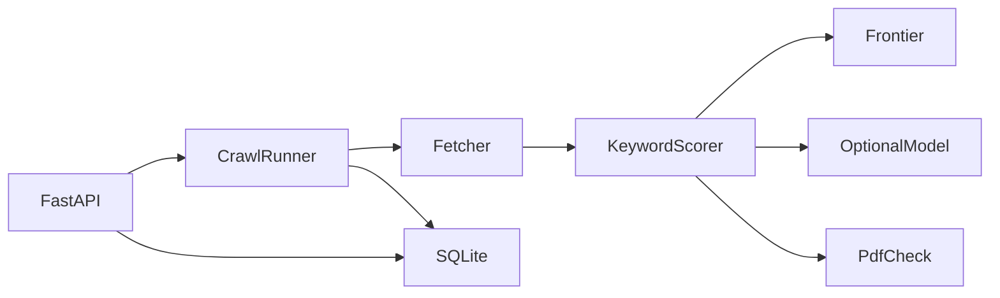
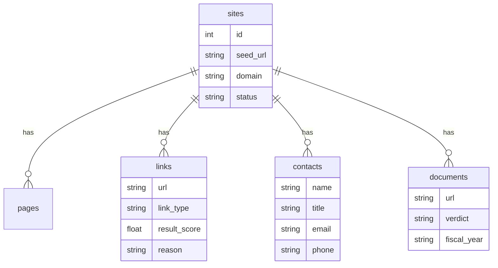
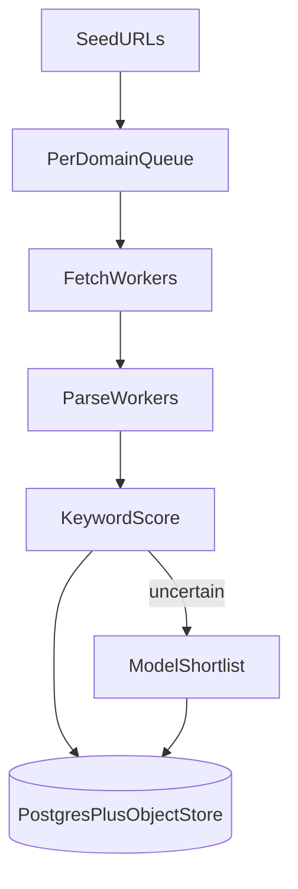
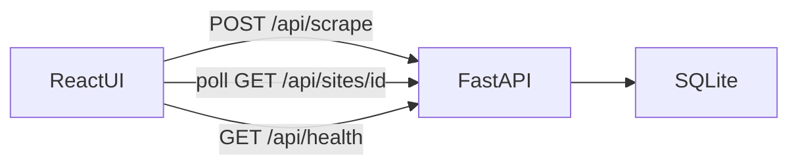

# High-Value Link Scraper

Crawl a public institution homepage, rank links that look like finance documents or finance contacts, store the results in SQLite, and serve them through a small FastAPI API. A React UI in [`frontend/`](frontend/) starts scrapes and shows live results.

Targets: ACFR/CAFR and budget documents, plus contacts such as a Finance Director. Keyword rules do the first pass. An optional model, called through an OpenAI-compatible API, can re-rank uncertain links, help bind names to titles, and second-guess PDF confirmation.

## Setup

```bash
python3 -m venv .venv
source .venv/bin/activate
pip install -r requirements.txt
```

Or with `uv`:

```bash
uv venv .venv
uv pip install -r requirements.txt
```

Frontend:

```bash
cd frontend
npm install
```

### Run locally (two terminals)

Terminal 1 — API:

```bash
source .venv/bin/activate
export PYTHONPATH=.
uvicorn app.main:app --reload --port 8000
```

**macOS with a broken stub resolver** (Python fails with "cannot resolve host" while `dig` works): start the API with the DNS fallback enabled:

```bash
DNS_FALLBACK=1 uvicorn app.main:app --reload --port 8000
```

Terminal 2 — UI:

```bash
cd frontend
npm run dev
```

Open [http://127.0.0.1:5173](http://127.0.0.1:5173). Vite proxies `/api/*` to the FastAPI server. CORS is also enabled for the Vite origin as a backup.

If the API sets `SCRAPER_API_KEY`, start the dev server with the same variable so the Vite proxy adds the `X-API-Key` header (the key stays on the dev-server side and is never put in the browser bundle):

```bash
SCRAPER_API_KEY=your-shared-secret npm run dev
```

### Environment variables

Copy [`.env.example`](.env.example) to `.env` (gitignored) for local use. It lists every variable with no values filled in; never commit real keys.

| Variable | Default | Purpose |
| --- | --- | --- |
| `SCRAPER_API_KEY` | unset | When set, `POST /scrape` (and `/api/scrape`) requires a matching `X-API-Key` header (constant-time compare, `401` otherwise). Unset means no auth. Leave unset on the public demo: the browser never sends this header. |
| `SCRAPE_RATE_LIMIT_PER_MINUTE` | `10` | Max `POST /scrape` requests per client IP per rolling minute. `429` with `Retry-After` when exceeded. `0` disables. |
| `MAX_CONCURRENT_SCRAPES` | `3` | Crawls allowed to run at once. A new crawl past the cap gets `503` with `Retry-After`. `0` disables. |
| `TRUST_FORWARDED_FOR` | off | `1`/`true` keys the rate limiter on Cloudflare's `CF-Connecting-IP` (then `True-Client-IP`, then `X-Forwarded-For`). Off uses the TCP peer so clients cannot spoof those headers. `render.yaml` turns this on for Render. |
| `DNS_FALLBACK` | off | `1`/`true` resolves hostnames through the nameservers in `/etc/resolv.conf` when the OS resolver fails (a macOS stub-resolver workaround). Installed at app startup, process-wide. Leave off in production. SSRF checks are the same either way: every resolved address must be globally routable. |
| `LLM_API_KEY`, `LLM_BASE_URL`, `LLM_MODEL` | unset / Gemini / `gemini-3.5-flash-lite` | Optional model, described below. |
| `SCRAPER_DB_PATH`, `SCRAPER_DATA_DIR` | `data/scraper.db`, `data/` | Where SQLite and the TLD cache live. Created at startup if missing. |
| `PORT` | `8000` | Listen port. Render and Railway set this. |

The rate limiter uses the TCP peer unless `TRUST_FORWARDED_FOR` is on. Render sits behind Cloudflare and a load balancer, so every request would otherwise share one IP; the Blueprint sets the flag. Do not enable it on a process that is reachable without that proxy.

Optional model (Gemini by default, any OpenAI-compatible chat API):

```bash
cp .env.example .env
# put your Gemini API key in .env as LLM_API_KEY=...
```

Or export in the shell that runs uvicorn:

```bash
export LLM_API_KEY=your-gemini-key
export LLM_BASE_URL=https://generativelanguage.googleapis.com/v1beta/openai/
export LLM_MODEL=gemini-3.5-flash-lite
```

`GEMINI_API_KEY` / `OPENAI_API_KEY` are accepted if `LLM_API_KEY` is unset. Point `LLM_BASE_URL` at another host (OpenAI, Groq, OpenRouter, Together) when that host speaks the same chat-completions API. If no key is set, the scraper uses keyword rules only. A model score on an uncertain link can raise or lower that link in the crawl.

## How ranking works

Each link gets two scores from the URL, anchor text, and nearby heading/list text, using weights in [`app/keywords.yaml`](app/keywords.yaml):

- **Follow score** — should the crawler open this page next? Terms like `finance`, `budget`, and `government` help. Parking, trash, jobs, and social links are pushed down.
- **Result score** — is this worth storing as a document, contact, or high-value navigation page?

Document links (`.pdf`, `.xlsx`, …) with finance keywords are checked: the first three pages are read (50 MB cap) and labeled `confirmed`, `mismatch`, `unreadable`, or `skipped`.

Contacts are pulled from finance-relevant staff/contact pages (the page's URL path or `<title>` must score as finance). A contact is stored only when it has an email or phone, and a phone-only entry also needs a person's name. Obfuscated emails (`name [at] city.gov`, Cloudflare `email-protection` links) and contact cards embedded as escaped HTML inside page scripts are decoded. A name is only guessed from page text when it fits the email address, so nav labels and sentences are not stored as people.

Links to leadership, staff-directory, and contact-us pages that already score as finance (follow score 50+) are crawled first and may sit one level deeper than other high-scoring finance pages, so they stay reachable under small UI limits. Links to `leadership-programs` and similar are excluded (`contact_page_terms` / `contact_page_exclusions` in `keywords.yaml`).





## API

| Method | Path | Purpose |
| --- | --- | --- |
| `GET` | `/health` | Process health and whether the model API answered |
| `POST` | `/scrape` | Start a background crawl. Needs `X-API-Key` when `SCRAPER_API_KEY` is set; `401` bad key, `429` rate limited, `503` too many crawls running |
| `GET` | `/sites` | List crawl jobs |
| `GET` | `/sites/{id}` | Job detail. `links` holds navigation and contact pages only; files (PDF, XLSX, SharePoint) are listed under `documents` |
| `GET` | `/links` | Query every stored link row, including `type=document` (`domain`, `type`, `min_score`, `q`) |

Example:

```bash
curl -s -X POST http://127.0.0.1:8000/scrape \
  -H 'content-type: application/json' \
  -H "X-API-Key: $SCRAPER_API_KEY" \
  -d '{"url":"https://www.a2gov.org/","max_pages":15,"max_depth":3}'

curl -s http://127.0.0.1:8000/sites/1 | python -m json.tool
curl -s 'http://127.0.0.1:8000/links?q=budget&min_score=20' | python -m json.tool
```

Omit the `X-API-Key` header when `SCRAPER_API_KEY` is unset. `GET /health` and the read endpoints are always open. A `429` or `503` response carries a `Retry-After` header in seconds.

Crawl jobs are asynchronous because some sites ask for a multi-second crawl delay. Poll `GET /sites/{id}` until `status` is `completed` or `failed`.

## Safety and politeness

- Same registrable domain as the seed (including `www`)
- Defaults: depth 3, 25 HTML pages, 8 document checks
- Delay is `max(robots crawl-delay, 1s)`, capped at 10s
- `robots.txt` is respected
- Only `http`/`https`; credentials in URLs are rejected
- Hostnames are resolved; loopback, private, link-local, and reserved addresses are blocked, including on redirect hops
- Response bodies capped at 50 MB
- `POST /scrape` can be gated by `X-API-Key`, rate limited per client, and capped at `MAX_CONCURRENT_SCRAPES` running crawls

## Tests

```bash
source .venv/bin/activate
export PYTHONPATH=.
pytest -q
```

Ground-truth replay: `tests/fixtures/sites/{asu,a2gov}` hold every HTTP response (trimmed HTML, robots.txt, short PDF text) from a real crawl with the UI settings (12 pages, depth 2, 8 document checks). `tests/fixtures/{asu,a2gov}_expected.json` list the pages, links, contacts, and documents a person finds on those pages. `tests/test_ground_truth.py` drives the real crawler over the fixtures, offline, and diffs against the expected files.

Live sample sites (network):

```bash
python scripts/run_live_samples.py
pytest -m live                    # includes the live ground-truth diff
python scripts/diff_live.py       # print actual vs expected (add --llm to use the configured model)
python scripts/dump_crawl.py https://asu.edu   # fetch order, contacts, documents
python scripts/record_fixture.py https://asu.edu asu   # refresh a fixture from the live site
```

## Sample site outcomes

Recorded with `scripts/run_live_samples.py` (`max_pages=8`, `max_depth=2`, keyword-only):

| Seed | Result |
| --- | --- |
| `https://www.a2gov.org/` | Completed. Strong finance navigation (`financial-reporting`, budget guides, treasury). Contacts pulled from contact pages. No PDF confirmed inside the 8-page budget; deeper crawls reach document libraries. |
| `https://bozeman.net/` | Failed with `HTTP 403` after redirect toward `bozemanmt.gov`. Stored as a clean failure, not a crash. |
| `https://asu.edu/` | Completed. Frontier preferred `cfo.asu.edu` budget/finance/contact URLs despite a noisy university homepage. |
| `https://boerneisd.net/` | Completed. Honored `Crawl-delay: 5` and stayed off disallowed paths. Found staff/contact signals; finance PDFs need a deeper or keyword-tuned run. |

## Deploy

One web process serves the built React UI at `/` and the API at `/api/*` (the same paths the Vite proxy uses in dev). Unprefixed API routes (`/health`, `/scrape`, …) stay available for the health check and curl. No separate frontend host, no browser CORS or API-key setup.

### Render Blueprint (Free web service)

1. Push this repo to GitHub; deploy from `main`.
2. In the [Render Dashboard](https://dashboard.render.com): **New → Blueprint**.
3. Connect the repo. Render reads [`render.yaml`](render.yaml) (Python runtime, Free plan, health check on `/health`).
4. Leave `LLM_API_KEY` and `SCRAPER_API_KEY` empty in the prompt (keyword-only mode; the UI cannot send `X-API-Key`). Set them later in the service's Environment page if you want the model or curl-only scrape auth.
5. Apply. Render runs the build and start commands below.

Build command:

```bash
./scripts/build.sh
```

(`python -m pip install -r requirements.txt`, then `npm ci` and `npm run build` in `frontend/`)

Start command:

```bash
./scripts/start.sh
```

(`uvicorn app.main:app --host 0.0.0.0 --port $PORT`)

Pinned versions in the Blueprint: `PYTHON_VERSION=3.12.10`, `NODE_VERSION=22.14.0`. `TRUST_FORWARDED_FOR=1` is set for you.

Same build/start and `$PORT` work on Railway or via the optional [`Dockerfile`](Dockerfile).

### Env vars on Render

| Variable | What to do |
| --- | --- |
| `LLM_API_KEY` | Leave empty for keyword-only. Optional; never commit a real value. |
| `SCRAPER_API_KEY` | Leave empty so the public UI can `POST /api/scrape`. Optional for curl-only lock-down. |
| `TRUST_FORWARDED_FOR` | Set to `1` by `render.yaml`. |
| `PYTHON_VERSION` / `NODE_VERSION` | Set by `render.yaml`. |
| `PORT` | Set by Render. Do not override. |
| `DNS_FALLBACK` | Leave unset. |

### Free-tier caveats

- After **15 minutes idle**, Render spins the service down. The next request takes **about a minute** (Render shows a loading page).
- The filesystem is ephemeral: SQLite under `data/` is **wiped on spin-down, restart, or redeploy**. That is expected for this demo.
- 750 Free instance hours per month; outbound bandwidth and build pipeline minutes count against the workspace included usage. Free services cannot attach a disk.

### Public deployment notes

One uvicorn process with SQLite and in-process background tasks is a demo topology. Before exposing it:

- Leave `SCRAPER_API_KEY` unset if the React UI should be able to start scrapes. TLS is terminated by Render. Keep `DNS_FALLBACK` off.
- The key, rate limit, and concurrency cap are per process and held in memory. They reset on restart and are not shared across workers, so run a single worker or move them out (below). Running crawls live inside the process and do not survive a restart.
- Reads (`/sites`, `/links`, and `/api/sites`, `/api/links`) are unauthenticated.
- Raw secrets belong in the platform's secret store, not in the image or repo. `.env` is for local use only. `render.yaml` marks `LLM_API_KEY` and `SCRAPER_API_KEY` as `sync: false` so Blueprint apply prompts instead of writing values into git.

What changes at scale: a gateway or API-key service replaces the shared secret (per-tenant keys, quotas, audit); rate limits and the crawl cap move to Redis or the job queue; crawls run in separate worker processes pulling from a queue instead of FastAPI background tasks; SQLite gives way to Postgres.

### Scaling to millions of pages a day

This submission is single-process SQLite. At ~1M pages/day you need about 12 pages/second on average. The bottleneck is per-domain politeness, not the model.

What that would look like:

1. A durable URL frontier (queue) with per-domain rate limits and crawl-delay
2. Canonical URL dedup before fetch
3. Separate fetch and parse workers
4. Postgres for metadata, object storage for raw HTML/PDF bytes
5. Keyword scoring on every link; a model only for uncertain scores, contact binding, and PDF second opinions, with template caching per CMS



## Frontend

The UI is a Vite + React + TypeScript app:

- Paste a seed URL, set max pages/depth, start a scrape
- Polls `GET /sites/{id}` while the job is running
- Tabs for ranked page links (filterable, files excluded), contacts, and document checks (every document link ends up here, confirmed or skipped)
- Distinct empty / crawling / failed / zero-result states
- Health badge for API up and whether the model API is available



Production uses those `/api/*` paths on the same origin (no Vite proxy). `GET /` is the built UI.

## Project layout

```
app/
  main.py          FastAPI routes, /api prefix, production UI serving
  security.py      API key check, per-client rate limiter
  resolve.py       Opt-in DNS fallback (DNS_FALLBACK=1)
  crawl.py         Frontier crawl loop
  fetch.py         HTTP, robots, SSRF guards
  score.py         Keyword scoring
  keywords.yaml    Editable weights
  extract.py       Links and contacts
  pdf_check.py     First-page document confirmation
  llm.py           Optional OpenAI-compatible model client
  db.py            SQLite schema and queries
frontend/          React UI (Vite + TypeScript)
scripts/           build.sh / start.sh, live samples, fixture recorder
render.yaml        Render Blueprint (Free web service)
Dockerfile         Optional container with the same build/start
tests/             unit tests + offline ground-truth replay (tests/fixtures)
```
